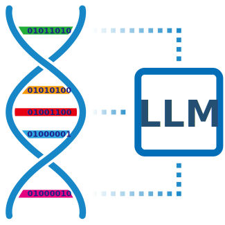

# DNALLM - DNA Large Language Model Toolkit

<div align="center">
  
</div>

[](https://www.python.org/downloads/)
[](https://opensource.org/licenses/MIT)
[](https://badge.fury.io/py/dnallm)

DNALLM is a comprehensive, open-source toolkit designed for fine-tuning and inference with DNA Language Models. It provides a unified interface for working with various DNA sequence models, supporting tasks ranging from basic sequence classification to advanced in-silico mutagenesis analysis.

## 🚀 Key Features

- **🔄 Model Management**: Load and switch between 30+ pre-trained DNA language models from Hugging Face and ModelScope
- **🎯 Multi-Task Support**: Binary/multi-class classification, regression, NER, MLM, and generation tasks
- **📊 Benchmarking**: Multi-model performance comparison and evaluation metrics
- **🔧 Fine-tuning**: Comprehensive training pipeline with configurable parameters
- **📱 Interactive Interfaces**: Jupyter notebooks and Marimo-based interactive demos
- **🌐 MCP Support**: Model Context Protocol for server/client deployment
- **🧬 Advanced Analysis**: In-silico mutagenesis, saturation mutation analysis, and mutation effect visualization

## 🧬 Supported Models

DNALLM supports a wide range of DNA language models including:

### Masked Language Models (MLM)
- **DNABERT Series**: Plant DNABERT, DNABERT, DNABERT-2, DNABERT-S
- **Caduceus Series**: Caduceus-Ph, Caduceus-PS, PlantCaduceus
- **Specialized Models**: AgroNT, GENA-LM, GPN, GROVER, MutBERT, ProkBERT

### Causal Language Models (CLM)
- **EVO Series**: EVO-1, EVO-2
- **Plant Models**: Plant DNAGemma, Plant DNAGPT, Plant DNAMamba
- **Other Models**: GENERator, GenomeOcean, HyenaDNA, Jamba-DNA, Mistral-DNA

### Model Sources
- **Hugging Face Hub**: Primary model repository
- **ModelScope**: Alternative model source with additional models
- **Custom Models**: Support for locally trained or custom architectures

## 🛠️ Installation

### Prerequisites
- Python 3.10 or higher (Python 3.12 recommended)
- Git
- CUDA-compatible GPU (optional, for GPU acceleration)
- **Environment Manager**: Choose one of the following:
  - Python venv (built-in)
  - Conda/Miniconda (recommended for scientific computing)

### Quick Installation with uv (Recommended)

DNALLM uses uv for dependency management and packaging.

[What is uv](https://docs.astral.sh/uv/) is a fast Python package manager that is 10-100x faster than traditional tools like pip.

#### Method 1: Using venv + uv

```bash
# Clone repository
git clone https://github.com/zhangtaolab/DNALLM.git
cd DNALLM

# Create virtual environment
python -m venv .venv

# Activate virtual environment
source .venv/bin/activate  # Linux/MacOS
# or
.venv\Scripts\activate     # Windows

# Upgrade pip (recommended)
pip install --upgrade pip

# Install uv in virtual environment
pip install uv

# Install DNALLM with base dependencies
uv pip install -e '.[base]'

# Verify installation
python -c "import dnallm; print('DNALLM installed successfully!')"
```

#### Method 2: Using conda + uv

```bash
# Clone repository
git clone https://github.com/zhangtaolab/DNALLM.git
cd DNALLM

# Create conda environment
conda create -n dnallm python=3.12 -y

# Activate conda environment
conda activate dnallm

# Install uv in conda environment
conda install uv -c conda-forge

# Install DNALLM with base dependencies
uv pip install -e '.[base]'

# Verify installation
python -c "import dnallm; print('DNALLM installed successfully!')"
```

### GPU Support

For GPU acceleration, install the appropriate CUDA version:

```bash
# For venv users: activate virtual environment
source .venv/bin/activate  # Linux/MacOS
# or
.venv\Scripts\activate     # Windows

# For conda users: activate conda environment
# conda activate dnallm

# CUDA 12.4 (recommended for recent GPUs)
uv pip install -e '.[cuda124]'

# Other supported versions: cpu, cuda121, cuda126, cuda128
uv pip install -e '.[cuda121]'
```

### Native Mamba Support

Native Mamba architecture runs significantly faster than transformer-compatible Mamba architecture, but native Mamba depends on Nvidia GPUs.

If you need native Mamba architecture support, after installing DNALLM dependencies, use the following command:

```bash
# For venv users: activate virtual environment
source .venv/bin/activate  # Linux/MacOS
# or
.venv\Scripts\activate     # Windows

# For conda users: activate conda environment
# conda activate dnallm

# Install Mamba support
uv pip install -e '.[mamba]' --no-cache-dir --no-build-isolation
```

Please ensure your machine can connect to GitHub, otherwise Mamba dependencies may fail to download.

## 🚀 Quick Start

### 1. Basic Model Loading and Inference

```python
from dnallm import load_config, load_model_and_tokenizer, DNAPredictor

# Load configuration
configs = load_config("./example/notebooks/inference/inference_config.yaml")

# Load model and tokenizer
model_name = "zhangtaolab/plant-dnagpt-BPE-promoter_strength_protoplast"
model, tokenizer = load_model_and_tokenizer(
    model_name, 
    task_config=configs['task'], 
    source="huggingface"
)

# Initialize predictor
predictor = DNAPredictor(config=configs, model=model, tokenizer=tokenizer)

# Make prediction
sequence = "AATATATTTAATCGGTGTATAATTTCTGTGAAGATCCTCGATACTTCATATAAGAGATTTTGAGAGAGAGAGAGAACCAATTTTCGAATGGGTGAGTTGGCAAAGTATTCACTTTTCAGAACATAATTGGGAAACTAGTCACTTTACTATTCAAAATTTGCAAAGTAGTC"
prediction = predictor.predict(sequence)
print(f"Prediction: {prediction}")
```

### 2. In-silico Mutagenesis Analysis

```python
from dnallm import Mutagenesis

# Initialize mutagenesis analyzer
mutagenesis = Mutagenesis(config=configs, model=model, tokenizer=tokenizer)

# Generate saturation mutations
mutagenesis.mutate_sequence(sequence, replace_mut=True)

# Evaluate mutation effects
predictions = mutagenesis.evaluate(strategy="mean")

# Visualize results
plot = mutagenesis.plot(predictions, save_path="mutation_effects.pdf")
```

### 3. Model Fine-tuning

```python
from dnallm.datahandling import DNADataset
from dnallm.finetune import DNATrainer

# Prepare dataset
dataset = DNADataset(
    data_path="path/to/your/data.csv",
    task_type="binary_classification",
    text_column="sequence",
    label_column="label"
)

# Initialize trainer
trainer = DNATrainer(
    config=configs,
    model=model,
    tokenizer=tokenizer,
    train_dataset=dataset
)

# Start training
trainer.train()
```

## 📚 Examples and Tutorials

### Interactive Demos (Marimo)
```bash
# Launch Jupyter Lab
uv run jupyter lab

# Launch Marimo
uv run marimo run xxx.py

# Fine-tuning demo
uv run marimo run example/marimo/finetune/finetune_demo.py

# Inference demo
uv run marimo run example/marimo/inference/inference_demo.py

# Benchmark demo
uv run marimo run example/marimo/benchmark/benchmark_demo.py
```

### Jupyter Notebooks
```bash
# Launch Jupyter Lab
uv run jupyter lab

# Available notebooks:
# - example/notebooks/finetune_plant_dnabert/ - Classification fine-tuning
# - example/notebooks/finetune_multi_labels/ - Multi-label classification
# - example/notebooks/finetune_NER_task/ - Named Entity Recognition
# - example/notebooks/inference_and_benchmark/ - Model evaluation
# - example/notebooks/in_silico_mutagenesis/ - Mutation analysis
# - example/notebooks/embedding_attention.ipynb - Embedding and attention analysis
```

## 🏗️ Project Structure

```
DNALLM/
├── dnallm/                    # Core library
│   ├── cli/                  # Command-line interface
│   │   ├── train.py         # Training command
│   │   ├── predict.py       # Inference command
│   │   └── model_config_generator.py # Configuration generator
│   ├── configuration/        # Configuration management
│   ├── datahandling/        # Dataset handling and processing
│   ├── finetune/            # Model fine-tuning pipeline
│   ├── inference/           # Inference and analysis tools
│   │   ├── benchmark.py     # Multi-model benchmark
│   │   ├── mutagenesis.py   # Mutation effect analysis
│   │   ├── plot.py          # Inference result visualization
│   │   └── predictor.py     # Model inference
│   ├── models/              # Model loading and management
│   ├── tasks/               # Task definitions and metrics
│   │   ├── task.py          # Supported task types
│   │   └── metrics/         # Evaluation functions for various tasks
│   ├── utils/               # Sequence processing and utility functions
│   └── mcp/                 # Model Context Protocol
├── example/                  # Examples and tutorials
│   ├── marimo/              # Interactive Marimo demos
│   └── notebooks/           # Jupyter notebook examples
├── docs/                     # Documentation
├── tests/                    # Test suite
└── scripts/                  # Utility scripts
```

## 🔧 Command Line Interface

DNALLM provides convenient CLI tools:

```bash
# Training
dnallm-train --config path/to/config.yaml

# Prediction
dnallm-predict --config path/to/config.yaml --input path/to/sequences.txt

# Model configuration generator
dnallm-model-config-generator

# MCP server
dnallm-mcp-server --config path/to/config.yaml
```

## 🎯 Supported Task Types

DNALLM supports the following task types:

- **EMBEDDING**: Extract embeddings, attention maps, and token probabilities for downstream analysis
- **MASK**: Masked language modeling task for pre-training
- **GENERATION**: Text generation task for causal language models
- **BINARY**: Binary classification task with two possible labels
- **MULTICLASS**: Multi-class classification task that specifies which class the input belongs to (more than two)
- **MULTILABEL**: Multi-label classification task with multiple binary labels per sample
- **REGRESSION**: Regression task which returns a continuous score
- **NER**: Token classification task which is usually for Named Entity Recognition

## 📖 Documentation

- **[Getting Started](docs/getting_started/)** - Installation and basic usage
- **[Tutorials](docs/tutorials/)** - Step-by-step guides for specific tasks
- **[API Reference](docs/api/)** - Detailed function documentation
- **[Concepts](docs/concepts/)** - Core concepts and architecture
- **[FAQ](docs/faq/)** - Common questions and solutions

## 🤝 Contributing

We welcome contributions! Please see our [Contributing Guide](CONTRIBUTING.md) for details on:

- Code style and standards
- Testing requirements
- Pull request process
- Development setup

## 📄 License

This project is licensed under the MIT License - see the [LICENSE](LICENSE) file for details.

## 🙏 Acknowledgments

- **Hugging Face** - Model hosting and transformers library
- **ModelScope** - Alternative model repository

## 📞 Support

- **Documentation**: [docs/](docs/)
- **Issues**: [GitHub Issues](https://github.com/zhangtaolab/DNALLM/issues)
- **Discussions**: [GitHub Discussions](https://github.com/zhangtaolab/DNALLM/discussions)
- **Examples**: Check the `example/` directory for working code

---

**DNALLM** - Empowering DNA sequence analysis with state-of-the-art language models.
