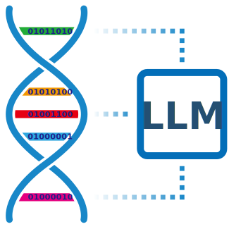

# DNALLM - DNA Large Language Model Toolkit

<div align="center">
  
</div>

[](https://www.python.org/downloads/)
[](https://opensource.org/licenses/MIT)
[](https://badge.fury.io/py/dnallm)

DNALLM is a comprehensive, open-source toolkit designed for fine-tuning and inference with DNA Language Models. It provides a unified interface for working with various DNA sequence models, supporting tasks ranging from basic sequence classification to advanced in-silico mutagenesis analysis. With built-in Model Context Protocol (MCP) support, DNALLM enables seamless communication with traditional large language models, allowing for enhanced integration and interoperability in AI-powered DNA analysis workflows.

## 🚀 Key Features

- **🔄 Model Management**: Load and switch between 150+ pre-trained DNA language models from Hugging Face and ModelScope
- **🎯 Multi-Task Support**: Binary/multi-class classification, regression, NER, MLM, and generation tasks
- **📊 Benchmarking**: Multi-model performance comparison and evaluation metrics
- **🔧 Fine-tuning**: Comprehensive training pipeline with configurable parameters
- **📱 Interactive Interfaces**: Jupyter notebooks and Marimo-based interactive demos
- **🌐 MCP Support**: Model Context Protocol for server/client deployment with real-time streaming
- **🧬 Advanced Analysis**: In-silico mutagenesis, saturation mutation analysis, and mutation effect visualization
- **🧪 Comprehensive Testing**: 200+ test cases covering all major functionality

## 🧬 Supported Models

DNALLM supports a wide range of DNA language models including:

### Masked Language Models (MLM)
- **DNABERT Series**: Plant DNABERT, DNABERT, DNABERT-2, DNABERT-S
- **Caduceus Series**: Caduceus-Ph, Caduceus-PS, PlantCaduceus
- **Specialized Models**: AgroNT, GENA-LM, GPN, GROVER, MutBERT, ProkBERT

### Causal Language Models (CLM)
- **EVO Series**: EVO-1, EVO-2
- **Plant Models**: Plant DNAGemma, Plant DNAGPT, Plant DNAMamba
- **Other Models**: GENERator, GenomeOcean, HyenaDNA, Jamba-DNA, Mistral-DNA

### Model Sources
- **Hugging Face Hub**: Primary model repository
- **ModelScope**: Alternative model source with additional models
- **Custom Models**: Support for locally trained or custom architectures

## 🛠️ Installation

### Prerequisites
- Python 3.10 or higher (Python 3.12 recommended)
- Git
- CUDA-compatible GPU (optional, for GPU acceleration)
- **Environment Manager**: Choose one of the following:
  - Python venv (built-in)
  - Conda/Miniconda (recommended for scientific computing)

### Quick Installation with uv (Recommended)

DNALLM uses uv for dependency management and packaging.

[What is uv](https://docs.astral.sh/uv/) is a fast Python package manager that is 10-100x faster than traditional tools like pip.

#### Method 1: Using venv + uv

```bash
# Clone repository
git clone https://github.com/zhangtaolab/DNALLM.git
cd DNALLM

# Create virtual environment
python -m venv .venv

# Activate virtual environment
source .venv/bin/activate  # Linux/MacOS
# or
.venv\Scripts\activate     # Windows

# Upgrade pip (recommended)
pip install --upgrade pip

# Install uv in virtual environment
pip install uv

# Install DNALLM with base dependencies
uv pip install -e '.[base]'

# For MCP server support (optional)
uv pip install -e '.[mcp]'

# Verify installation
python -c "import dnallm; print('DNALLM installed successfully!')"
```

#### Method 2: Using conda + uv

```bash
# Clone repository
git clone https://github.com/zhangtaolab/DNALLM.git
cd DNALLM

# Create conda environment
conda create -n dnallm python=3.12 -y

# Activate conda environment
conda activate dnallm

# Install uv in conda environment
conda install uv -c conda-forge

# Install DNALLM with base dependencies
uv pip install -e '.[base]'

# For MCP server support (optional)
uv pip install -e '.[mcp]'

# Verify installation
python -c "import dnallm; print('DNALLM installed successfully!')"
```

### GPU Support

For GPU acceleration, install the appropriate CUDA version:

```bash
# For venv users: activate virtual environment
source .venv/bin/activate  # Linux/MacOS
# or
.venv\Scripts\activate     # Windows

# For conda users: activate conda environment
# conda activate dnallm

# CUDA 12.4 (recommended for recent GPUs)
uv pip install -e '.[cuda124]'

# Other supported versions: cpu, cuda121, cuda126, cuda128
uv pip install -e '.[cuda121]'
```

### Native Mamba Support

Native Mamba architecture runs significantly faster than transformer-compatible Mamba architecture, but native Mamba depends on Nvidia GPUs.

If you need native Mamba architecture support, after installing DNALLM dependencies, use the following command:

```bash
# For venv users: activate virtual environment
source .venv/bin/activate  # Linux/MacOS

# For conda users: activate conda environment
# conda activate dnallm

# Install Mamba support
uv pip install -e '.[mamba]' --no-cache-dir --no-build-isolation

# If encounter network issue, using the special install script for mamba (optional)
sh scripts/install_mamba.sh  # select github proxy
```

Please ensure your machine can connect to GitHub, otherwise Mamba dependencies may fail to download.

Note that Plant DNAMamba, Caduceus, PlantCaduceus, PlantCAD2, Jamba-DNA, JanusDNA models are all based on Mamba architecture. Therefore, the training and inference of these models can be accelerated by installing the native mamba support.

### Install Dependencies for Special Models

Several models require extra dependencies to train or inference.

These models are listed below:

|  Models  | Model Type | Source | Dependencies |
| -------- | ---------- | ------ | ------------ |
| EVO-1    | CausalLM   | [Hugging Face](https://huggingface.co/collections/togethercomputer/stripedhyena-65d8e6e77540dd1da932dbe1) | [GitHub](https://github.com/evo-design/evo) |
| EVO2     | CausalLM   | [Hugging Face](https://huggingface.co/collections/arcinstitute/evo-68e42c1bceeb21a456330fb4) | [GitHub](https://github.com/arcinstitute/evo2) |
| GPN      | MaskedLM   | [Hugging Face](https://huggingface.co/songlab) | [GitHub](https://github.com/songlab-cal/gpn) |
| megaDNA  | CausalLM   | [Hugging Face](https://huggingface.co/lingxusb) | [GitHub](https://github.com/lingxusb/megaDNA) |
| LucaOne  | CausalLM   | [Hugging Face](https://huggingface.co/collections/LucaGroup/lucaone-689c4c52fc6577441093f208) | [GitHub](https://github.com/LucaOne/LucaOne) |
| Omni-DNA | CausalLM   | [Hugging Face](https://huggingface.co/collections/zehui127/omni-dna-67a2230c352d4fd8f4d1a4bd) | [GitHub](https://github.com/Zehui127/Omni-DNA) |

The installation method for the dependencies of these models can be found **[here](docs/getting_started/installation.md)**.

## 🚀 Quick Start

### 1. Basic Model Loading and Inference

```python
from dnallm import load_config, load_model_and_tokenizer, DNAInference

# Load configuration
configs = load_config("./example/notebooks/inference/inference_config.yaml")

# Load model and tokenizer
model_name = "zhangtaolab/plant-dnagpt-BPE-promoter_strength_protoplast"
model, tokenizer = load_model_and_tokenizer(
    model_name, 
    task_config=configs['task'], 
    source="huggingface"
)

# Initialize inference engine
inference_engine = DNAInference(model=model, tokenizer=tokenizer, config=configs)

# Make inference
sequence = "AATATATTTAATCGGTGTATAATTTCTGTGAAGATCCTCGATACTTCATATAAGAGATTTTGAGAGAGAGAGAGAACCAATTTTCGAATGGGTGAGTTGGCAAAGTATTCACTTTTCAGAACATAATTGGGAAACTAGTCACTTTACTATTCAAAATTTGCAAAGTAGTC"
inference_result = inference_engine.infer(sequence)
print(f"Inference result: {inference_result}")
```

### 2. In-silico Mutagenesis Analysis

```python
from dnallm.inference import Mutagenesis

# Initialize mutagenesis analyzer
mutagenesis = Mutagenesis(model=model, tokenizer=tokenizer, config=configs)

# Generate saturation mutations
mutagenesis.mutate_sequence(sequence, replace_mut=True)

# Evaluate mutation effects
predictions = mutagenesis.evaluate(strategy="mean")

# Visualize results
plot = mutagenesis.plot(predictions, save_path="mutation_effects.pdf")
```

### 3. Model Fine-tuning

```python
from dnallm import load_config, load_model_and_tokenizer
from dnallm.datahandling import DNADataset
from dnallm.finetune import DNATrainer

# Load configuration
configs = load_config("path/to/config.yaml")

# Load model and tokenizer
model_name = "zhangtaolab/plant-dnabert-BPE"
model, tokenizer = load_model_and_tokenizer(
    model_name,
    task_config=configs["task"],
    source="huggingface"
)

# Prepare dataset
dataset = DNADataset.load_local_data(
    file_paths="path/to/your/data.csv",
    seq_col="sequence",
    label_col="label",
    tokenizer=tokenizer,
)

# Encode the sequences
dataset.encode_sequences()

# Initialize trainer
trainer = DNATrainer(
    model=model,
    config=configs,
    datasets=dataset
)

# Start training
trainer.train()
```

### 4. MCP Server Deployment

```python
# Start MCP server for real-time DNA sequence prediction
import asyncio
from dnallm.mcp.server import DNALLMMCPServer

async def main():
    # Initialize MCP server
    server = DNALLMMCPServer("config/mcp_server_config.yaml")
    await server.initialize()
    
    # Start server with SSE transport for real-time streaming
    await server.start_server(host="0.0.0.0", port=8000, transport="sse")

if __name__ == "__main__":
    asyncio.run(main())
```

#### MCP Server Features
- **Real-time Streaming**: Server-Sent Events (SSE) for live prediction updates
- **Multiple Transport Protocols**: STDIO, SSE, and Streamable HTTP
- **Comprehensive Tools**: 10+ MCP tools for DNA sequence analysis
- **Model Management**: Dynamic model loading and switching
- **Batch Processing**: Efficient handling of multiple sequences
- **Health Monitoring**: Built-in server diagnostics and status checks

#### Available MCP Tools
- `dna_sequence_predict` - Single sequence prediction
- `dna_batch_predict` - Batch sequence processing
- `dna_multi_model_predict` - Multi-model comparison
- `dna_stream_predict` - Real-time streaming prediction
- `list_loaded_models` - Model management
- `health_check` - Server monitoring

## 📚 Examples and Tutorials

### Interactive Demos (Marimo)
```bash
# Launch Jupyter Lab
uv run jupyter lab

# Fine-tuning demo
uv run marimo run example/marimo/finetune/finetune_demo.py

# Inference demo
uv run marimo run example/marimo/inference/inference_demo.py

# Benchmark demo
uv run marimo run example/marimo/benchmark/benchmark_demo.py
```

### Web-based UI (Gradio)
```bash
# Launch Gradio configuration generator app
uv run python ui/run_config_app.py

# Or run the model config generator directly
uv run python ui/model_config_generator_app.py
```

### Jupyter Notebooks
```bash
# Launch Jupyter Lab
uv run jupyter lab

# Available notebooks:
# - example/notebooks/finetune_binary/ - Binary classification fine-tuning
# - example/notebooks/finetune_multi_labels/ - Multi-label classification
# - example/notebooks/finetune_NER_task/ - Named Entity Recognition
# - example/notebooks/inference_and_benchmark/ - Model evaluation
# - example/notebooks/in_silico_mutagenesis/ - Mutation analysis
# - example/notebooks/inference_for_tRNA/ - tRNA-specific analysis
# - example/notebooks/inference_evo_models/ - EVO model inference
# - example/notebooks/lora_finetune_inference/ - LoRA fine-tuning
# - example/notebooks/embedding_attention.ipynb - Embedding and attention analysis
```

## 🏗️ Project Structure

```
DNALLM/
├── dnallm/                     # Core library package
│   ├── __init__.py             # Package initialization and main exports
│   ├── version.py              # Version information
│   ├── cli/                    # Command-line interface tools
│   │   ├── __init__.py
│   │   ├── cli.py              # Main CLI entry point
│   │   ├── train.py            # Training command implementation
│   │   ├── inference.py        # Inference command implementation
│   │   └── model_config_generator.py # Interactive config generator
│   ├── configuration/          # Configuration management system
│   │   ├── __init__.py
│   │   ├── configs.py          # Configuration classes and loaders
│   │   └── evo                 # Folder contains configs for loading evo models
│   ├── datahandling/           # Dataset processing and management
│   │   ├── __init__.py
│   │   ├── README.md
│   │   ├── data.py             # Core dataset classes
│   │   └── dataset_auto.py     # Automatic dataset builders
│   ├── finetune/               # Model fine-tuning pipeline
│   │   ├── __init__.py
│   │   └── trainer.py          # Training logic and utilities
│   ├── inference/              # Inference and analysis tools
│   │   ├── __init__.py
│   │   ├── benchmark.py        # Multi-model performance comparison
│   │   ├── inference.py        # Core inference engine
│   │   ├── mutagenesis.py      # In-silico mutation analysis
│   │   └── plot.py             # Result visualization tools
│   ├── models/                 # Model loading and management
│   │   ├── __init__.py
│   │   ├── model.py            # Model utilities and helpers
│   │   ├── model_info.yaml     # Model registry and metadata
│   │   └── modeling_auto.py    # Automatic model loading
│   ├── tasks/                  # Task definitions and evaluation
│   │   ├── __init__.py
│   │   ├── task.py             # Task type definitions
│   │   ├── metrics.py          # Evaluation metrics
│   │   └── metrics/            # Individual metric implementations
│   │       ├── accuracy/       # Accuracy metrics
│   │       ├── f1/             # F1 score metrics
│   │       ├── precision/      # Precision metrics
│   │       ├── recall/         # Recall metrics
│   │       ├── roc_auc/        # ROC-AUC metrics
│   │       ├── mse/            # Mean squared error
│   │       ├── mae/            # Mean absolute error
│   │       ├── r_squared/      # R-squared metrics
│   │       └── ... (30+ metrics)
│   ├── utils/                  # Utility functions and helpers
│   │   ├── __init__.py
│   │   ├── logger.py           # Logging utilities
│   │   └── sequence.py         # DNA sequence processing
│   └── mcp/                    # Model Context Protocol server
│       ├── __init__.py
│       ├── README.md           # MCP documentation (Chinese)
│       ├── DEVELOPMENT.md      # Development guide
│       ├── server.py           # MCP server implementation
│       ├── start_server.py     # Server startup script
│       ├── config_manager.py   # Configuration management
│       ├── config_validators.py # Input validation
│       ├── model_manager.py    # Model lifecycle management
│       ├── example_sse_usage.py # SSE usage examples
│       ├── run_tests.py        # Test runner
│       ├── requirements.txt    # MCP-specific dependencies
│       ├── test_mcp_curl.md    # MCP testing documentation
│       ├── configs/            # MCP configuration files
│       │   ├── mcp_server_config.yaml
│       │   ├── promoter_inference_config.yaml
│       │   ├── conservation_inference_config.yaml
│       │   └── ... (task-specific configs)
│       └── tests/              # MCP test suite
│           ├── __init__.py
│           ├── test_config_manager.py
│           ├── test_config_validators.py
│           ├── test_mcp_functionality.py
│           ├── test_server_integration.py
│           ├── test_sse_client.py
│           └── configs/        # Test configurations
├── cli/                        # Legacy CLI scripts (deprecated)
│   ├── cli.py
│   ├── inference.py
│   ├── train.py
│   ├── model_config_generator.py
│   └── examples/               # CLI configuration examples
├── example/                    # Examples and interactive demos
│   ├── README.md               # Example documentation
│   ├── marimo/                 # Interactive Marimo applications
│   │   ├── benchmark/          # Benchmarking demos
│   │   ├── finetune/           # Fine-tuning demos
│   │   └── inference/          # Inference demos
│   ├── mcp_example/            # MCP usage examples
│   │   └── mcp_client_ollama_pydantic_ai.ipynb
│   └── notebooks/              # Jupyter notebook tutorials
│       ├── benchmark/          # Model comparison notebooks
│       ├── finetune_binary/    # Binary classification training
│       ├── finetune_multi_labels/ # Multi-label classification
│       ├── finetune_NER_task/  # Named entity recognition
│       ├── inference/          # Inference demonstrations
│       ├── inference_for_tRNA/ # tRNA-specific analysis
│       ├── in_silico_mutagenesis/ # Mutation effect analysis
│       └── embedding_attention.ipynb # Embedding visualization
├── docs/                       # Comprehensive documentation
│   ├── index.md                # Documentation home page
│   ├── api/                    # API reference documentation
│   │   ├── datahandling/       # Dataset handling APIs
│   │   ├── finetune/           # Training APIs
│   │   ├── inference/          # Inference APIs
│   │   ├── mcp/                # MCP APIs
│   │   └── utils/              # Utility APIs
│   ├── cli/                    # Command-line interface docs
│   ├── concepts/               # Core concepts and architecture
│   ├── getting_started/        # Installation and setup guides
│   ├── tutorials/              # Step-by-step tutorials
│   ├── resources/              # Additional resources
│   └── pic/                    # Documentation images
├── tests/                      # Comprehensive test suite
│   ├── TESTING.md              # Testing documentation
│   ├── pytest.ini              # Pytest configuration
│   ├── benchmark/              # Benchmarking tests
│   ├── datahandling/           # Dataset handling tests
│   ├── finetune/               # Training pipeline tests
│   ├── inference/              # Inference engine tests
│   ├── utils/                  # Utility function tests
│   └── test_data/              # Test datasets
│       ├── binary_classification/
│       ├── multiclass_classification/
│       ├── multilabel_classification/
│       ├── regression/
│       ├── token_classification/
│       └── embedding/
├── ui/                         # Web-based user interfaces
│   ├── README.md               # UI documentation
│   ├── model_config_generator_app.py # Gradio configuration app
│   ├── run_config_app.py       # App launcher
│   └── requirements.txt        # UI-specific dependencies
├── scripts/                    # Development and deployment scripts
│   ├── check_code.py           # Code quality checker
│   ├── check_code.sh           # Shell script for code checks
│   ├── check_code.bat          # Windows batch script
│   ├── ci_checks.sh            # Continuous integration checks
│   ├── install_mamba.sh        # Mamba installation script
│   ├── publish.sh              # Package publishing script
│   └── setup_uv.sh             # UV package manager setup
├── .github/                    # GitHub workflows and templates
├── .flake8                     # Code style configuration
├── .gitignore                  # Git ignore patterns
├── .pre-commit-config.yaml     # Pre-commit hooks
├── CONTRIBUTING.md             # Contribution guidelines
├── LICENSE                     # MIT license
├── README.md                   # This file
├── conftest.py                 # Pytest configuration
├── mkdocs.yml                  # Documentation configuration
├── pyproject.toml              # Project metadata and dependencies
├── setup.py                    # Package setup script
└── run_cli.py                  # Legacy CLI runner
```

## 🔧 Command Line Interface

DNALLM provides convenient CLI tools:

```bash
# Main CLI with subcommands
dnallm --help

# Training
dnallm train --config path/to/config.yaml
# or
dnallm-train --config path/to/config.yaml

# Inference
dnallm inference --config path/to/config.yaml --input path/to/sequences.txt
# or
dnallm-inference --config path/to/config.yaml --input path/to/sequences.txt

# Model configuration generator
dnallm-model-config-generator

# MCP server
dnallm-mcp-server --config path/to/config.yaml
```

## 🎯 Supported Task Types

DNALLM supports the following task types:

- **EMBEDDING**: Extract embeddings, attention maps, and token probabilities for downstream analysis
- **MASK**: Masked language modeling task for pre-training
- **GENERATION**: Text generation task for causal language models
- **BINARY**: Binary classification task with two possible labels
- **MULTICLASS**: Multi-class classification task that specifies which class the input belongs to (more than two)
- **MULTILABEL**: Multi-label classification task with multiple binary labels per sample
- **REGRESSION**: Regression task which returns a continuous score
- **NER**: Token classification task which is usually for Named Entity Recognition

## 🧪 Testing

DNALLM includes a comprehensive test suite with 200+ test cases:

```bash
# Run all tests
uv run pytest

# Run specific test categories
uv run pytest tests/inference/ -v
uv run pytest tests/mcp/ -v
uv run pytest tests/tasks/ -v

# Run with coverage
uv run pytest --cov=dnallm --cov-report=html
```

## 📖 Documentation

- **[Getting Started](docs/getting_started/)** - Installation and basic usage
- **[Tutorials](docs/tutorials/)** - Step-by-step guides for specific tasks
- **[API Reference](docs/api/)** - Detailed function documentation
- **[Concepts](docs/concepts/)** - Core concepts and architecture
- **[FAQ](docs/faq/)** - Common questions and solutions

## 🤝 Contributing

We welcome contributions! Please see our [Contributing Guide](CONTRIBUTING.md) for details on:

- Code style and standards
- Testing requirements
- Pull request process
- Development setup

## 📄 License

This project is licensed under the MIT License - see the [LICENSE](LICENSE) file for details.

## 🙏 Acknowledgments

- **Hugging Face** - Model hosting and transformers library
- **ModelScope** - Alternative model repository

## 📞 Support

- **Documentation**: [docs/](docs/)
- **Issues**: [GitHub Issues](https://github.com/zhangtaolab/DNALLM/issues)
- **Discussions**: [GitHub Discussions](https://github.com/zhangtaolab/DNALLM/discussions)
- **Examples**: Check the `example/` directory for working code

---

**DNALLM** - Empowering DNA sequence analysis with state-of-the-art language models.
